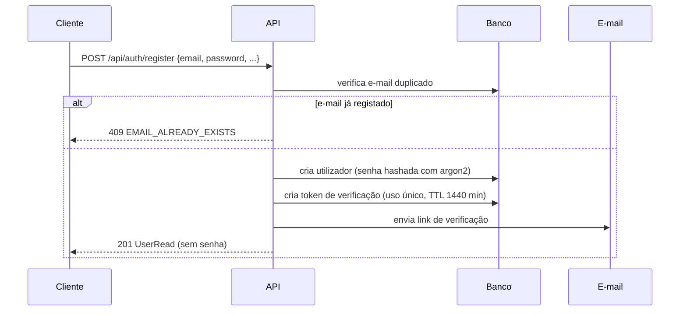
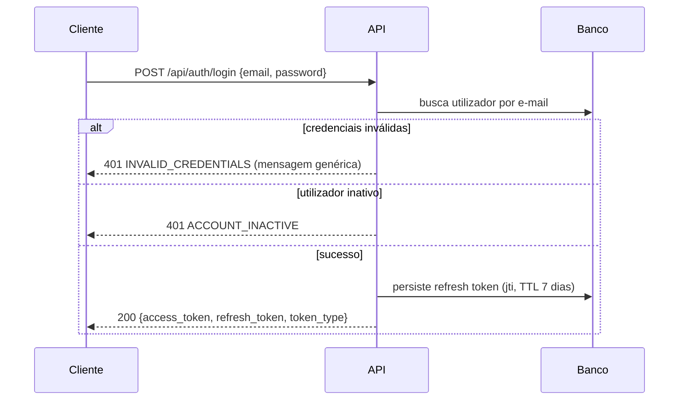
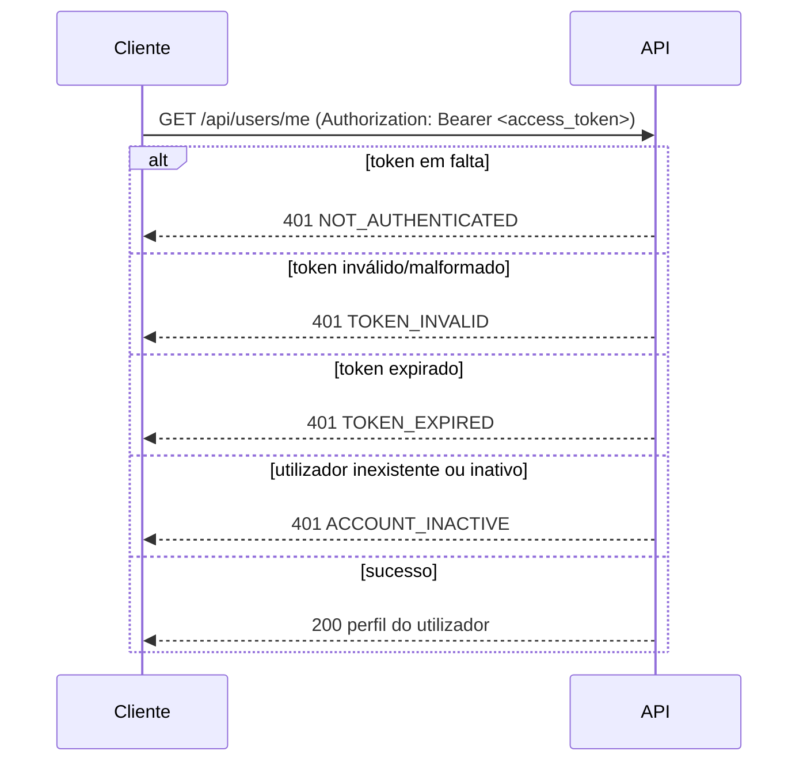
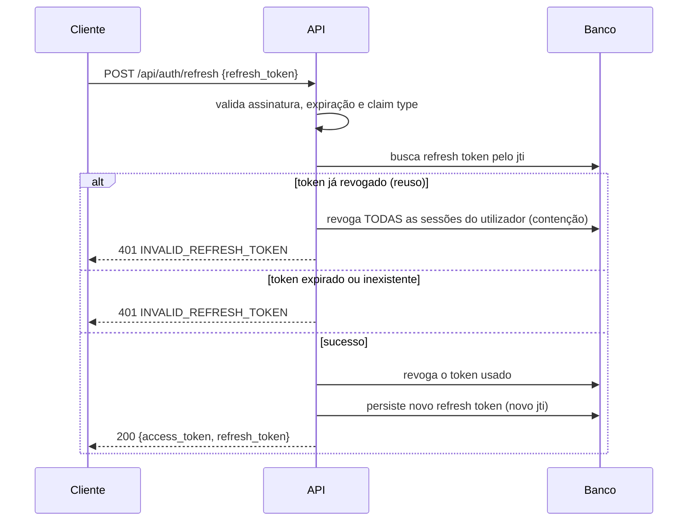
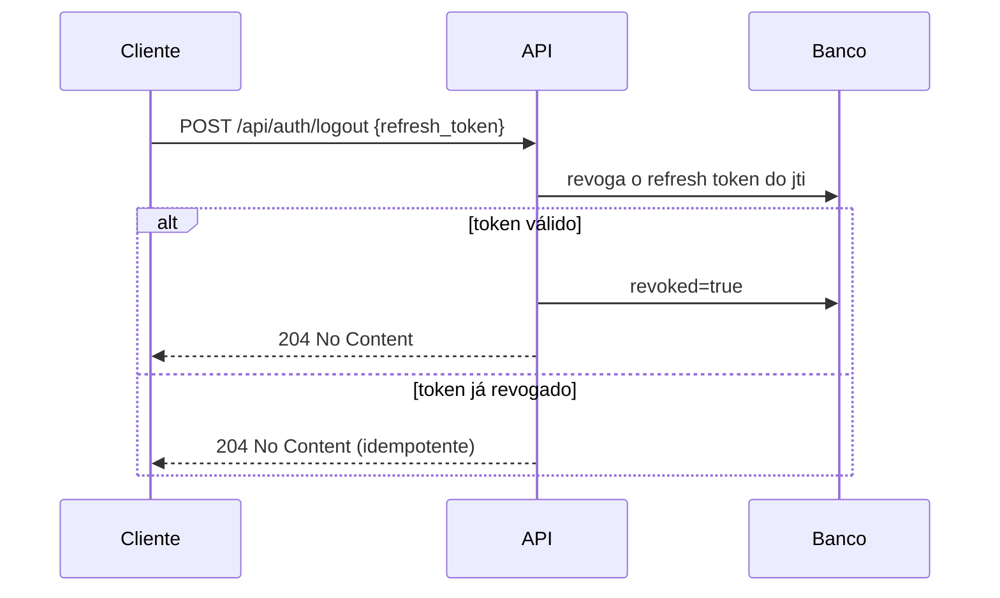
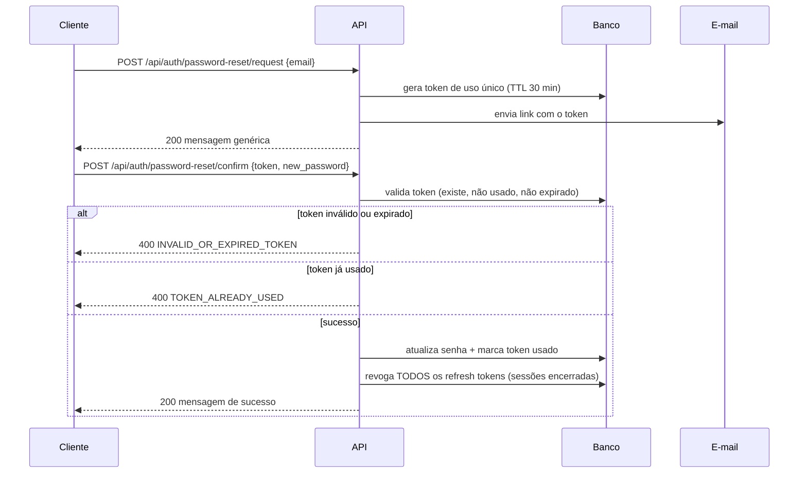
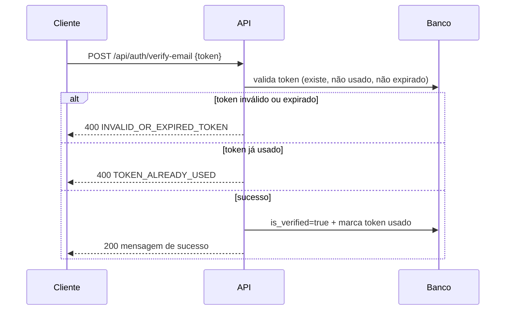
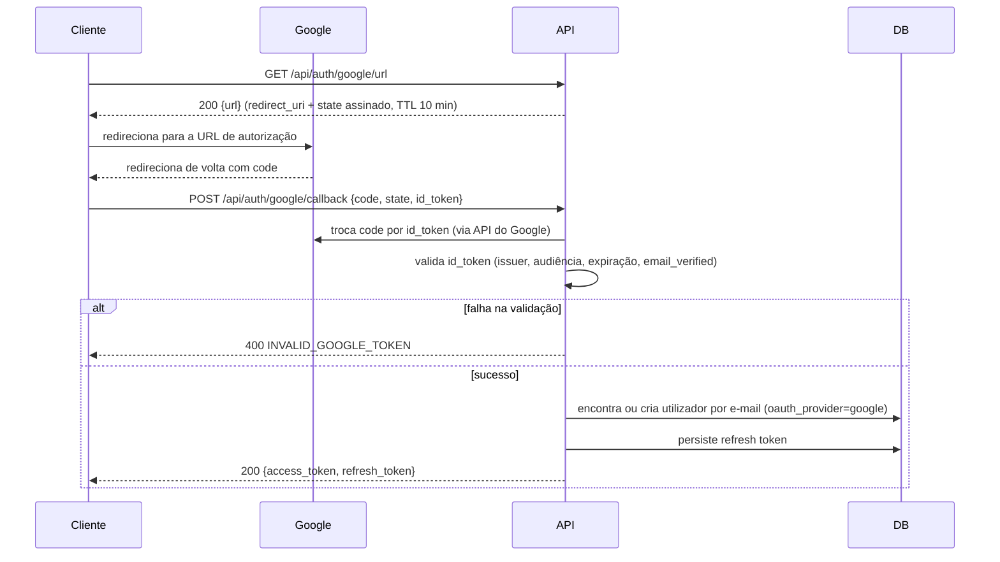

# Fluxo de autenticação

Documento de referência do fluxo completo de autenticação da aplicação:
registro, login, rotas protegidas, refresh, logout, recuperação de senha,
verificação de e-mail e login social com Google. Corresponde à issue
`[EPIC-8][DOCS] Documentar fluxo de autenticação`.

Serve para onboarding de novos desenvolvedores e para times de
frontend/integração: descreve o comportamento real da API, sem exigir leitura
do código-fonte.

## Resumo dos endpoints

Todos os endpoints de autenticação ficam sob o prefixo `/api/auth`.

| Método | Rota | Autenticação exigida | Descrição |
|---|---|---|---|
| `POST` | `/api/auth/register` | — | Cria utilizador e envia e-mail de verificação (201). |
| `POST` | `/api/auth/login` | — | Login com e-mail/senha; devolve par de tokens. |
| `POST` | `/api/auth/login-form` | — | Igual ao login, usando `application/x-www-form-urlencoded` (OAuth2 password form). |
| `POST` | `/api/auth/refresh` | — (refresh token) | Roda o refresh token e devolve novo par. |
| `POST` | `/api/auth/logout` | — (refresh token) | Revoga o refresh token enviado (204, idempotente). |
| `POST` | `/api/auth/password-reset/request` | — | Envia e-mail de recuperação (resposta genérica). |
| `POST` | `/api/auth/password-reset/confirm` | — | Redefine a senha com o token recebido. |
| `POST` | `/api/auth/verify-email` | — | Confirma o e-mail com o token de verificação. |
| `POST` | `/api/auth/verify-email/resend` | — | Reenvia o token de verificação. |
| `GET` | `/api/auth/google/url` | — | Devolve a URL de autorização do Google (login social). |
| `POST` | `/api/auth/google/callback` | — | Troca o `code` do Google por sessão local (login social). |

## Estados do utilizador

| Estado | Campo | Efeito na autenticação |
|---|---|---|
| Ativo | `is_active=true` | Pode autenticar. `false` = login negado (`ACCOUNT_INACTIVE`). |
| Inativo | `is_active=false` | Não pode autenticar; tokens de refresh são revogados na desativação. |
| Verificado | `is_verified=true` | E-mail confirmado. |
| Não verificado | `is_verified=false` | Pode autenticar normalmente; apenas fica registado o estado. Recebe link de verificação no registro. |

> `is_verified` **não bloqueia o login** — apenas controla o envio do e-mail
> de verificação e o estado exibido no perfil.

## Registro



- Senha validada contra a política (ver
  [docs/password-policy.md](password-policy.md)): mín. 8, máx. 128, com
  maiúscula, minúscula, dígito e especial; rejeita senhas comuns.
- E-mails duplicados são rejeitados com `409 EMAIL_ALREADY_EXISTS`.
- A senha nunca é devolvida nem logada; apenas o hash é persistido.

## Login



- **Bloqueio por tentativas falhas:** tentativas consecutivas inválidas são
  contadas numa janela (`LOGIN_ATTEMPT_WINDOW_MINUTES`). Ao atingir
  `LOGIN_MAX_ATTEMPTS`, o identificador é bloqueado por
  `LOGIN_BLOCK_DURATION_MINUTES` e o login responde `429 TOO_MANY_ATTEMPTS`
  com o header `Retry-After`.
- O login exige `is_active=true`; utilizadores desativados recebem
  `ACCOUNT_INACTIVE`.

## Rotas protegidas



- O access token é enviado no header `Authorization: Bearer <token>`.
- A resolução é feita por `get_current_user`, que valida a assinatura, a
  expiração, o `sub` e o estado ativo do utilizador (ver
  [docs/error-codes.md](error-codes.md)).
- Autorização por roles/permissões é aplicada após a autenticação — ver
  [docs/rbac-model.md](rbac-model.md).

## Refresh (rotação)



- Cada refresh token é **de utilização única**: após a rotação deixa de
  funcionar.
- O reuso de um token já rotacionado/revogado é tratado como possível
  comprometimento e revoga **todas** as sessões ativas do utilizador.
- Detalhes completos em [docs/token-policy.md](token-policy.md).

## Logout



- Idempotente: revogar um token já revogado continua devolvendo `204`.
- O access token permanece válido até a expiração natural (15 min).

## Recuperação e redefinição de senha



- A resposta de `request` nunca revela se o e-mail está registado
  (anti-enumeração).
- Após a redefinição, todas as sessões ativas do utilizador são revogadas —
  é preciso fazer login de novo.

## Verificação de e-mail



- O token é gerado no registro e tem TTL de 1 dia
  (`EMAIL_VERIFICATION_TOKEN_EXPIRE_MINUTES`).
- `POST /api/auth/verify-email/resend` envia um novo link para utilizadores
  registados e não verificados (resposta genérica).

## Login social com Google



- O recurso só está disponível com `GOOGLE_LOGIN_ENABLED=true`; caso contrário
  devolve `403 GOOGLE_LOGIN_DISABLED`.
- O `state` é um token assinado (anti-CSRF) que expira em
  `GOOGLE_STATE_TTL_MINUTES` (10 min).
- O utilizador é criado/vinculado por e-mail com `oauth_provider=google` e
  `google_id`; senha local permanece nula.

## Ciclo de vida e claims dos tokens

| Token | Algoritmo | Chave | TTL padrão | Claim de tipo |
|---|---|---|---|---|
| Access | HS256 (`ALGORITHM`) | `SECRET_KEY` | `JWT_ACCESS_MINUTES` (15 min) | `type: "access"` |
| Refresh | HS256 | `REFRESH_SECRET_KEY` (fallback `SECRET_KEY`) | `JWT_REFRESH_DAYS` (7 dias) | `type: "refresh"` |

Claims mínimos presentes em todos os tokens: `sub` (id do utilizador),
`exp` (expiracção, Unix UTC), `iat` (emissão), `type`. O refresh token
carrega ainda `jti` — identificador único persistido em `refresh_tokens`,
usado para rotação e revogação.

Regras de revogação, rotação e contenção de reuso: consulte
[docs/token-policy.md](token-policy.md).

## Erros comuns

Formato padrão das respostas de erro:

```json
{
  "error": { "type": "...", "message": "...", "code": "..." },
  "status": 401,
  "path": "/api/users/me",
  "method": "GET"
}
```

Códigos relevantes para autenticação:

| `code` | Status | Quando |
|---|---|---|
| `NOT_AUTHENTICATED` | 401 | Token em falta. |
| `TOKEN_INVALID` | 401 | Token malformado/inválido. |
| `TOKEN_EXPIRED` | 401 | Token expirado. |
| `ACCOUNT_INACTIVE` | 401 | Utilizador inexistente ou inativo. |
| `INVALID_CREDENTIALS` | 401 | E-mail/senha incorretos. |
| `INVALID_REFRESH_TOKEN` | 401 | Refresh token inválido/expirado/revogado. |
| `INVALID_OR_EXPIRED_TOKEN` | 400 | Token de redefinição/verificação inválido ou expirado. |
| `TOKEN_ALREADY_USED` | 400 | Token de utilização única já consumido. |
| `TOO_MANY_ATTEMPTS` | 429 | Bloqueio por tentativas de login falhas. |
| `RATE_LIMIT_EXCEEDED` | 429 | Rate limit de rota sensível excedido. |
| `EMAIL_ALREADY_EXISTS` | 409 | E-mail já registado. |
| `GOOGLE_LOGIN_DISABLED` | 403 | Login Google desativado. |
| `INVALID_GOOGLE_TOKEN` | 400 | `code`/`id_token`/`state` inválido. |
| `GOOGLE_AUTH_ERROR` | 502 | Falha de comunicação com a API do Google. |

Lista completa e orientações de tratamento pelo frontend:
[docs/error-codes.md](error-codes.md).
