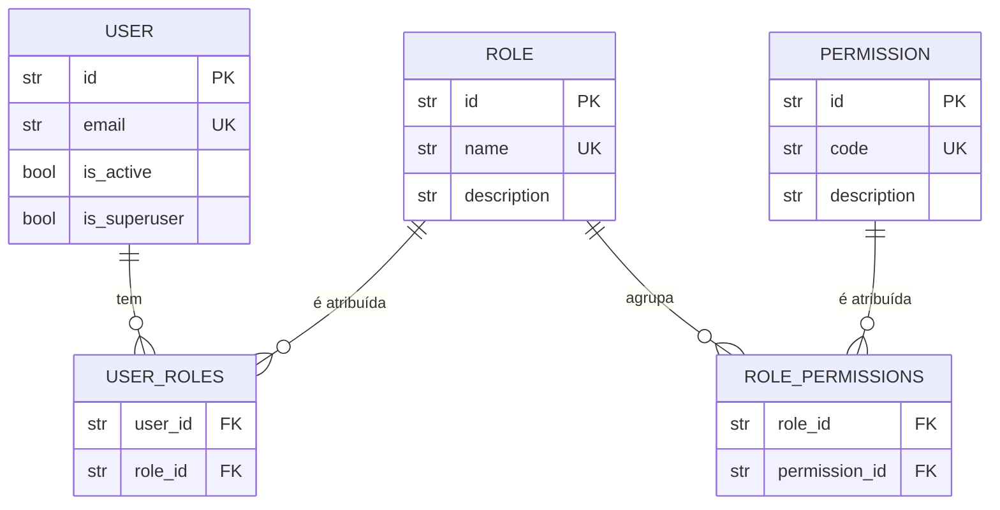

# Modelo RBAC — roles e permissões

Documento de referência conceitual do modelo de autorização (RBAC) adotado
pelo projeto: entidades, relações, roles e permissões padrão, e como
proteger rotas na prática. Corresponde à issue
`[EPIC-8][DOCS] Documentar modelo de roles e permissões`.

A matriz **endpoint-a-endpoint** (qual rota exige o quê) está em
[docs/authorization-matrix.md](authorization-matrix.md) — este documento
explica o **modelo**; a matriz é a fonte de verdade por rota.

## Conceito central

A permissão efetiva de um utilizador é a **soma das permissões de todas as
suas roles**:

```
utilizador —(N:N)— roles —(N:N)— permissions
```

- Um utilizador possui uma ou mais roles.
- Uma role agrupa uma ou mais permissões.
- Um utilizador pode ter a permissão de qualquer uma das suas roles.
- Não há hierarquia/hereditariedade automática entre roles: cada role tem o
  seu conjunto **explícito** de permissões.

## Modelo de dados



Implementação:

| Entidade | Tabela | Arquivo |
|---|---|---|
| `User` | `users` | `app/models/user.py` |
| `Role` | `roles` | `app/models/role.py` |
| `Permission` | `permissions` | `app/models/permission.py` |
| associação N:N | `user_roles` | `app/models/user.py` |
| associação N:N | `role_permissions` | `app/models/permission.py` |

## Roles padrão (seed)

O seed (`app/db/init_db.py`) cria por padrão:

| Role | Descrição | Permissões |
|---|---|---|
| `admin` | Acesso administrativo total | Todas: `users:*`, `roles:read`, `roles:manage` |
| `user` | Utilizador autenticado padrão | Apenas `users:read` |

## Convenção de permissões

A convenção adotada é `recurso:ação`:

| Permissão | Significado |
|---|---|
| `users:create` | Criar utilizadores |
| `users:read` | Ler utilizadores |
| `users:update` | Atualizar utilizadores |
| `users:delete` | Apagar utilizadores |
| `roles:read` | Consultar roles |
| `roles:manage` | Gerir roles (atribuição, criação) |

Ao adicionar permissões novas, siga o mesmo padrão (`recurso:ação`), com
descrição clara e atribuição explícita às roles no seed.

## Protegendo rotas: `require_role` vs `check_permission`

Duas dependências em `app/api/dependencies/permissions.py` centralizam toda
a autorização. **Rotas não implementam verificações ad-hoc inline.**

| Dependência | Checa | Quando usar |
|---|---|---|
| `require_role('admin')` | Se o utilizador tem **pelo menos uma** das roles listadas | Áreas administrativas amplas (ex.: listar todos os utilizadores) |
| `check_permission('users:delete')` | Se o utilizador tem a **permissão granular** (via roles) | Ações específicas e sensíveis |

Orientação prática:

- Use `require_role` quando a restrição é "quem pode entrar nesta área"
  (ex.: painel de administração, `roles: admin`).
- Use `check_permission` quando a restrição é "quem pode executar esta ação"
  (ex.: apagar um utilizador, exigindo `users:delete`), mesmo que hoje a role
  `admin` concentre todas as permissões — a checagem granular permite dar a
  permissão a outras roles no futuro sem mudar código.

Ambas devolvem `403 PermissionDeniedError` (o utilizador está autenticado,
mas não autorizado):

- `require_role` → `code: INSUFFICIENT_ROLE`
- `check_permission` → `code: INSUFFICIENT_PERMISSION`

### Exemplos de uso

```python
from typing import Annotated
from fastapi import APIRouter, Depends

from app.api.dependencies.auth import CurrentUserDep
from app.api.dependencies.database import SessionDep
from app.api.dependencies.permissions import require_role, check_permission
from app.models.user import User

router = APIRouter(prefix='/users', tags=['users'])


@router.get('/me')
async def my_profile(user: CurrentUserDep) -> User:
    """Qualquer utilizador autenticado (sem autorização adicional)."""
    return user


@router.get('')
async def list_users(
    db: SessionDep,
    _: Annotated[User, Depends(require_role('admin'))],
) -> list[User]:
    """Restrito a utilizadores com a role admin."""
    ...


@router.delete('/{user_id}')
async def delete_user(
    db: SessionDep,
    _: Annotated[User, Depends(check_permission('users:delete'))],
    user_id: str,
) -> None:
    """Restrito a quem tem a permissão users:delete."""
    ...
```

> `get_current_user` carrega roles e permissões antecipadamente
> (`selectinload`), então `require_role`/`check_permission` funcionam em
> contexto assíncrono sem lazy-load.

## Como adicionar uma nova role ou permissão

1. **Permissão nova:** adicione a tupla em `DEFAULT_PERMISSIONS` em
   `app/db/init_db.py` com o padrão `("recurso:ação", "descrição",
   ["role1", "role2"])`.
2. **Role nova:** adicione a tupla em `DEFAULT_ROLES` e a associe às
   permissões desejadas.
3. **Aplicar:** rode o seed (idempotente — não duplica dados):
   ```bash
   uv run python -m app.db.init_db
   ```
4. **Proteger rotas:** use `require_role(...)`/`check_permission(...)` nas
   rotas que devem exigir a nova role/permissão.
5. **Atribuir a utilizadores:** via `PUT /api/users/{id}/roles`
   (role `admin`), que substitui o conjunto completo de roles.

## Limitações conhecidas

- **Sem hierarquia de roles:** não há herança automática entre roles; cada
  role tem o seu conjunto explícito de permissões.
- **`check_permission` é single-code:** aceita um único código de permissão,
  não combinações AND/OR de múltiplas permissões. Para exigir alternativas,
  use `require_role`; para combinações complexas, componha no service.
- **Roles são relidas a cada requisição:** alterações de role aplicam-se
  imediatamente na próxima requisição autenticada (não há cache de permissões
  em memória).
- **Remoção da role `admin`:** revoga todas as sessões do utilizador afetado
  (e um admin não pode remover a própria role `admin` — `SELF_ROLE_REMOVAL_NOT_ALLOWED`).

## Referências

- Matriz endpoint-a-endpoint: [docs/authorization-matrix.md](authorization-matrix.md)
- Formato de erros (`INSUFFICIENT_ROLE`, `INSUFFICIENT_PERMISSION`):
  [docs/error-codes.md](error-codes.md)
- Seed de roles/permissões: `app/db/init_db.py`
- Implementação das dependências: `app/api/dependencies/permissions.py`
