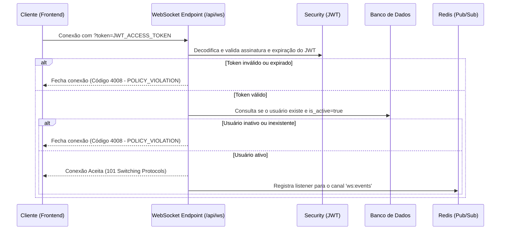

# WebSockets e Notificações em Tempo Real

Documento de referência da arquitetura de comunicação em tempo real via WebSockets da Auth API.
Descreve como clientes (web/mobile) se conectam, o processo de autenticação via JWT, a distribuição de eventos com suporte a múltiplas instâncias via Redis Pub/Sub e os formatos de mensagens.

---

## 1. Visão Geral

O endpoint WebSocket permite que clientes recebam notificações imediatas sobre alterações em suas contas e eventos de segurança sem necessidade de polling HTTP.

* **Endpoint:** `GET /api/ws?token=<access_token>`
* **Protocolo:** WebSocket (`ws://` ou `wss://` em produção)
* **Autenticação:** Obrigatória via query parameter `token` (JWT Access Token válido)
* **Escalabilidade:** Suporte a múltiplas réplicas da API com sincronização via canal Redis Pub/Sub (`ws:events`)

---

## 2. Fluxo de Conexão e Autenticação

O handshake WebSocket executa autenticação imediata antes de aceitar a conexão:



### Códigos de Encerramento do WebSocket:
* `1000` — Encerramento normal (Normal Closure).
* `4001` — Desconexão forçada por evento de segurança (ex: senha alterada ou conta desativada).
* `4008` — Falha na autenticação (token inválido, ausente ou conta inativa).

---

## 3. Arquitetura Multi-Instância (Redis Pub/Sub)

Em ambientes com múltiplos nós/contêineres da API:
1. O usuário A conecta seu WebSocket na **Instância 1**.
2. Uma ação administrativa (ex: alteração de role) ocorre na **Instância 2**.
3. A **Instância 2** publica o evento no canal Redis `ws:events`.
4. A **Instância 1** recebe o evento via Redis e envia a mensagem para o WebSocket do usuário A.

Se a variável `REDIS_URL` não estiver definida (ex: desenvolvimento local), a aplicação utiliza fallback para gerenciamento local de memória em instância única.

---

## 4. Eventos Disparados e Formato dos Payloads

As mensagens enviadas aos clientes WebSocket seguem a estrutura JSON padronizada:

```json
{
  "event": "nome.do.evento",
  "data": {
    ...
  },
  "timestamp": "2026-08-18T16:00:00Z"
}
```

### Eventos Suportados:

| Evento | Descrição | Ação recomendada no Frontend |
| :--- | :--- | :--- |
| `user.updated` | Dados cadastrais (nome/e-mail) foram atualizados | Atualizar dados de perfil na interface |
| `user.roles_changed` | Permissões ou roles foram alteradas por um admin | Renovar token de acesso ou recarregar permissões |
| `user.password_changed` | A senha da conta foi alterada | Redirecionar para tela de login *(desconexão forçada)* |
| `user.deactivated` | A conta foi desativada | Exibir mensagem de bloqueio e deslogar *(desconexão forçada)* |

#### Exemplo de Mensagem (`user.roles_changed`):
```json
{
  "event": "user.roles_changed",
  "data": {
    "user_id": "b8de84c8-7899-4d84-b15a-a281c96c0e5f",
    "roles": ["admin", "user"],
    "message": "Suas permissões foram atualizadas."
  },
  "timestamp": "2026-08-18T16:05:12.345Z"
}
```

---

## 5. Exemplo de Integração no Frontend (JavaScript / React)

### Exemplo em JavaScript Nativo:

```javascript
class AuthWebSocket {
  constructor(token) {
    this.token = token;
    this.socket = null;
    this.connect();
  }

  connect() {
    const protocol = window.location.protocol === 'https:' ? 'wss:' : 'ws:';
    const host = window.location.host;
    const wsUrl = `${protocol}//${host}/api/ws?token=${this.token}`;

    this.socket = new WebSocket(wsUrl);

    this.socket.onopen = () => {
      console.log(' Conectado ao WebSocket de Notificações');
    };

    this.socket.onmessage = (event) => {
      try {
        const payload = JSON.parse(event.data);
        console.log('🔔 Notificação recebida:', payload);

        if (payload.event === 'user.roles_changed') {
          // Atualizar estado global de permissões
        } else if (payload.event === 'user.deactivated') {
          alert('Sua conta foi desativada.');
          window.location.href = '/login';
        }
      } catch (err) {
        console.error('Erro ao processar mensagem do WebSocket:', err);
      }
    };

    this.socket.onclose = (event) => {
      console.warn(`WebSocket fechado (código ${event.code}). Reconectando em 5s...`);
      if (event.code !== 4001 && event.code !== 4008) {
        setTimeout(() => this.connect(), 5000);
      }
    };

    this.socket.onerror = (err) => {
      console.error('Erro no WebSocket:', err);
    };
  }

  disconnect() {
    if (this.socket) {
      this.socket.close();
    }
  }
}
```

---

## 6. Rate Limiting de Conexões WebSocket

Para mitigar ataques de exaustão de sockets, o endpoint possui limite configurável:
* **Variável:** `RATE_LIMIT_WEBSOCKET` (Padrão: `30/minute`)
* Conexões que excederem a taxa recebem erro de conexão recusada no handshake.
